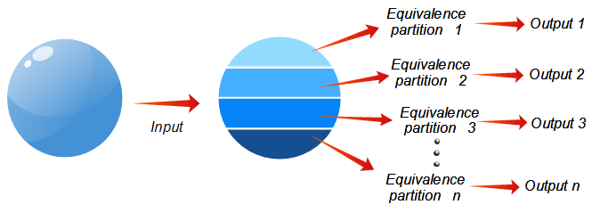
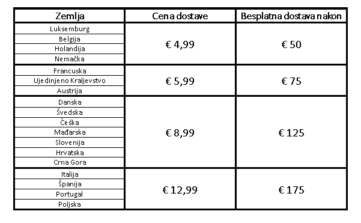
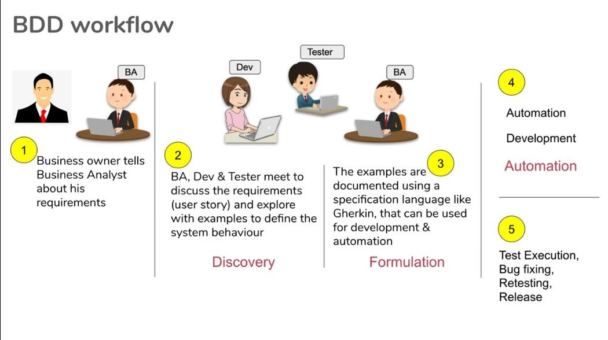
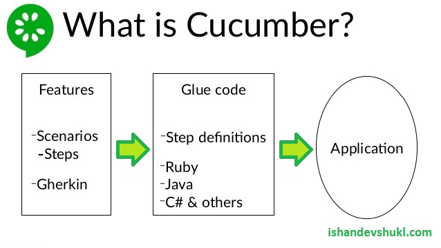
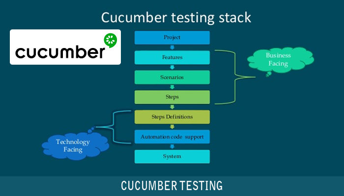
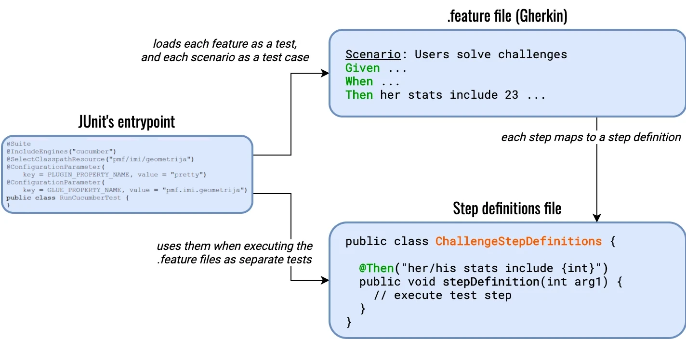

# Sadržaj

- [Unit Testing](#unit-testing)
- [Equivalence partitioning](#equivalence-partitioning)
- [Behaviour-Driven Development](#behaviour-driven-development)
   - [Cucumber](#cucumber)
     - [Scenario Outline & Examples](#scenario-outline--examples)
       - [Problem sa automatskim generisanjem definicija koraka u IntelliJ-u](#problem-sa-automatskim-generisanjem-definicija-koraka-u-intellij-u)


# Unit Testing

Koristan materijal:
- [Effective Unit Testing by Eliotte Rusty Harold (48m9; opciono)][unit testing - erh]
- [Unit testing best practices with .NET Core and .NET Standard][unit testing - ms .net docs]


# Equivalence partitioning

Koristan materijal:
- [Equivalence Partitioning Test Design Technique Explanation (13m11s)][equivalence partitioning - software testing 101]
- [Explain Equivalence Class Partition with example? (26m27s)][equivalence partitioning - qafox]
- [ISTQB Foundation Level Chapter 4 Equivalence Partitioning (57m29s; od 0:19:11 do 1:16:40)][equivalence partitioning - ISTQB Foundation]
  - prethodna 2 linka bi trebala da opišu teorijski deo i da prikažu na nekoliko primera kako to izgleda, a na ovom linku možete da provežbate dosta zadataka različitog tipa i težine (veći deo klipa čine zadaci)

Predstavlja tehniku **blackbox** testiranja.

Ideja kod ove tehnike je da se **smanji** broj test case-ova, a da pritom pokrivenost vrednosti ostane ista. Ulazi se grupišu u klase (ekvivalencije) tako da članovi klase uzrokuju isto ponašanje aplikacije. To nam omogućava da izaberemo samo neke **predstavnike** jedne grupe i da onda njih koristimo za testiranje, a da ono što zaključimo iz toga primenimo na ostale pripadnike te grupe. Time ne moramo da testiramo sve moguće vrednosti.

Ono na šta treba obratiti pažnju jeste i to da **klase ekvivalencije ne moraju da se definišu samo nad ulaznim
podacima**. Klase ekvivalencije možemo definisati nad nekim skupom mogućih vrednosti gde taj skup možemo
podeliti na više manjih, tako da možemo uzeti po 1 element iz svakog skupa kao predstavnika celog skupa i da
pretpostavimo da će se svi ostali elementi iz datog podskupa ponašati na identičan način. 


|  | 
|:--:| 
| *Izvor: [t2tho.blogspot.com](https://t2tho.blogspot.com/2015/04/mot-so-ky-thuat-testing.html)* |
	

Kao što možemo videti na slici, prostor mogućih vrednosti se grupiše u klase (particije) ulaza za koje se očekuje da će imati **isto** ponašanje, odnosno izlaz u ovom slučaju.

Na primer, ako jedna klasa predstavlja parne brojeve, to znači da za bilo koja 2 parna broja mi očekujemo da će se sistem ponašati isto. Ponašanje sistema za unos `2`, `-200`, `0` i `1234` bi trebalo da bude isto.

Drugi primer je znak celog broja, tj. signum. Možemo definisati tri klase: 
* grupu negativnih brojeva, 
* grupu pozitivnih brojeva i
* grupu koja sadrži nulu. 

Za prvu grupu možemo izabrati vrednosti `-100`, `-38`,  `-1`, za drugu `23`, `1234`, `5`, a za treću `0`. Ove vrednosti bi bile predstavnici tih grupa. Njih ćemo koristiti kao vrednosti za **test case-ove**.

Umesto testiranja svakog broja iz grupe, testiramo mali broj predstavnika te grupe.

---

Klase koje sadrže validne ulaze na osnovu specifikacije se nazivaju **validnim klasama** ili **legalnim klasama**. Ako aplikacija prihvata samo parne brojeve onda bismo mogli da kažemo da je klasa parnih brojeva legalna klasa.

Klase koje predstavljaju nevalidne ulaze se nazivaju **nelegalnim klasama** ili **nevalidnim klasama**. U prethodnom primeru, klasa neparnih brojeva bi bila nelegalna klasa.

Ova tehnika se koristi i nad podacima koji **nisu brojevi**. Na primer, unos mesta boravka ili unos države na sajtu za kupovinu. U ovom drugom slučaju (sajt za kupovinu) možemo imati
polje za izbor države. Na osnovu tog izbora se npr. vrši određivanje cene porudžbine. Tada sajt može računati cenu na osnovu regiona, gde je jedna cena za Aziju, druga za Evropu, 
treća za Afriku, i tako dalje. Tad bismo mogli da grupišemo države na osnovu regiona/kontinenta jer bi izračunata cena od strane aplikacije bila ista za države iz istog regiona.


S obzirom da se sa vrednostima legalne klase kreiraju testovi kojima se proverava ispravan unos, možemo da **iskombinujemo** više legalnih klasa različitih uslova uz specifikacije u aplikaciju tako da jedan use case pokriva više legalnih klasa. Ispravan unos treba da zadovoljava sve uslove, što znači da treba da obuhvati što veći broj legalnih klasa, idealno sve ako je to moguće.

Uzmimo kao primer neko polje za lozinku. U specifikaciji su navedeni sledeći uslovi:
* lozinka mora biti duža od 4 znaka
* lozinka mora da sadrži veliko slovo
* lozinka mora da sadrži broj

Za prvi uslov imamo sledeće klase ekvivalencije:
* **(A1)** lozinka ima manje od 4 karaktera (nelegalna)
* **(A2)** lozinka ima 4 ili više karaktera (legalna)

Za drugi uslov:
* **(B1)** lozinka ne sadrži veliko slovo (nelegalna)
* **(B2)** lozinka sadrži veliko slovo (legalna)

Za treći uslov:
* **(C1)** lozinka ne sadrži broj (nelegalna)
* **(C2)** lozinka sadrži broj (legalna)

A2, B2 i C2 možemo iskombinovati u test case jer je reč o legalnim klasama. Primer takvog test case-a: `primeR8`. Ovaj string pokriva sve legalne klase.

Za nelegalne klase ovo **ne treba** raditi. Razlog je to što test case-ovima koji su kreirani na osnovu te klase želimo da detektujemo grešku. Ako imamo test koji pokriva više nelegalnih klasa i dođe do njegovog pada, mi ne možemo da znamo o kojoj je klasi reč i da li bi pao i za druge klase koje pokriva. Ako bismo za svaku ipak definisali po test case, postojala bi mogućnost da padne zbog klase za koju nije namenjen, a to nam samo remeti analizu rezultata. Zato je najbolje da test case-ovi nelegalne klase pokrivaju samo jednu nelegalnu klasu. Proveru da li više uslova prolazi za jedan ulaz svakako već vršimo legalnim klasama. 

**Za svaku klasu ekvivalencije treba definisati barem 1 test case i poželjno je da svaka od izabranih vrednosti bude korišćena samo za jedan test case.**

# Behaviour-Driven Development

Koristan materijal:
- [What You Need To Know About Behavior Driven Development In 4 minutes (4m15s)][bdd - 4min Mark Shead]
- [Behavior Driven Development (27m46s)][bdd - Development That Pays playlist] 

**Behaviour-Driven Development** je tip razvoja softvera koji stavlja akcenat na saradnju između biznis timova i tehničkih timova.
	
> BDD is a way for software teams to work that closes the gap between business people and technical people by:
> 
> Encouraging collaboration across roles to build shared understanding of the problem to be solved
> 
> Working in rapid, small iterations to increase feedback and the flow of value
>
> Producing system documentation that is automatically checked against the system’s behaviour
>
> \- [Cucumber Docs](https://cucumber.io/docs/bdd/)

Suština jeste rešavanje problema u komunikaciji pri razvoju softvera.

Biznis timovi znaju šta je korisniku potrebno, a tehnički timovi kako se to može implementirati.

BDD nam omogućava da svi imaju isto razumevanje aplikacije jer koriste isti opis (specifikaciju).

U okviru njega se generiše zajednička dokumentacija koja se može razumeti od strane svih učesnika (timova).

---

Bilo koja promena aplikacije započinje user story-em.

User story je opis feature-a iz perspektive korisnika.

Koristi se u diskusiji između timova. Mogu da komentarišu nešto što je svima poznato i tako izbegnu situaciju u kojoj pričaju 
o istom problemu iz različitih perspektiva gde svako ima drugačiji kontekst na osnovu kog donosi zaključke.

Tip TDD-a (Test-Driven Development) jer se prvo generiše test, a zatim piše kod.

Zove se još i "živom" dokumentacijom jer je uvek ažurna (up-to-date) zbog toga što bilo koja promena u sistemu otpočinje promenom dokumentacije. Takođe se naziva i "executable" dokumentacijom jer predstavlja dokumentaciju napisanu na prirodnom jeziku, npr. engleskom, koja se može izvrši pozivanjem odgovarajućeg testa koji validira da li se program ponaša u skladu sa datim delom dokumentacije. 

Ako dođe do potrebe za promenom aplikacije, menja se i ova dokumetacija, a zatim se po njoj ostalo prilagođava. To što se radi u odnosu na nju omogućava da svi timovi budu upoznati sa istom dokumentacijom i da rade u odnosu na nju.

BDD se sastoji iz 3 faze:
1. Discovery - članovi različitih timova se sastanu i diskutuju o feature-u (scenariju)
2. Formulation - nakon konačnog dogovora formuliše se ceo feature u vidu specifikacije (npr. Gherkin skripte)
3. Automation - na osnovu specifikacije generišu se testovi (npr. pomoću Cucumber-a)

Ovime se prave testovi koji usmeravaju pisanje koda.

|  | 
|:--:| 
| *Izvor: [Automation Step by Step (YouTube)](https://www.youtube.com/watch?v=xD9x_VxFHM8)* |


## Cucumber

Koristan materijal:
- [Intro to Gherkin - How To Write A Test In Gherkin (4m26s)][gherkin - how to write test]
- [Cucumber - Gherkin Reference][gherkin - reference]
- [Cucumber - Step Definition][cucumber - step def]
- [Cucumber School - BDD with Cucumber in Java][cucumber - school]
  - zvanični kurs Cucumber framework-a
  - nije loše za osnove, neke informacije se nalaze u lekcijama sa konceptima koje nećemo raditi pa se kao dopuna preporučuje čitanje dokumentacije ili sadržaja koji se nalazi ispod u nastavku ovog poglavlja
  - delovi koji se tiču našeg kursa su:
    - `1. Discovering BDD`
    - `2. Your first scenario`
    - `3. Expressing yourself` (do lekcije 3.3)
- [IntelliJ IDEA - Cucumber Support][cucumber - intellij]

Alat koji podržava rad BDD-a.

Omogućava automatizaciju dokumentacije. To znači da nudi automatsko kreiranje dela testa na osnovu specifikacije.

|  | 
|:--:| 
| *Izvor: [ishandevshukl.com](http://www.ishandevshukl.com/2017/09/what-is-gherkin-for-cucumber.html)* |

Jezik za pisanje specifikacije/dokumentacije koji koristi je **Gherkin**. Definiše se u fajlu: `<ime>.feature`. Po konvenciji, ovaj fajl se postavlja adresu: `src/test/resources/<paket>/<ime>.feature`, npr. `src/test/resources/pmf/imi/geometrija`. Kao što možete primetiti, ovaj fajl se nalazi u folderu `resources` u hijerarhiji foldera `test`.

Dokumentacija se piše po scenarijima za odgovarajuću funkcionalnost (feature). Sam fajl počinje sa: `feature: <ime>`. Za ime se po konvenciji navodi isti naziv kao i naziv samog feature fajla, a on treba da opisuje samu funkcionalnost koju predstavlja. Npr. `user_login.feature` bi započinjao sa: `Feature: User Login`. **Napomena**: ovo nije obavezno, samo predstavlja konvenciju.

Scenariji se započinju sa `Scenario:`. I kod `Feature` i kod `Scenario` potrebno je navesti `:` jer je to bitan deo sintakse za ove dve ključne reči.

Primer:
```Gherkin
Feature: User Login

Scenario: User enters valid credentials
```

Svaki scenario sadrži korake (steps) koji se mogu grupisati u 3 dela: 
* `Given` - stanja (preduslovi/činjenice) pre akcije ili triger. Redosled između stanja nije bitan.
* `When` - akcija / triger. Redosled koraka je bitan.
* `Then` - činjenice/stanja nakon akcije ili trigera. Redosled nije bitan.

`Given` predstavlja kontekst scenarija, početnu tačku. U njemu definišemo šta u tom početnom trenutku važi, tj. kakve je stanje. 
Tu retko kada imamo potrebe za nekakvih redosledom tih koraka koji ga čine jer je reč o iskazima koji govore o stanju, o nečemu što je trenutno.

`When` predstavlja deo u kome se dešavaju neki događaji/akcije. Ti događaji utiču na trenutno stanje i menjaju ga, čime se dobija novo stanje. 
S obzirom da se radi o promenama stanja, redosled koraka u ovom delu je najčešće bitan, tj. koraci su na neki način povezani određenim redosledom.

`Then` predstavlja ishode, novo stanje nakon promene. Ovde takođe spominjemo stanja, neke iskaze kojima se opisuje šta se očekuje nakon datih događaja/promena. 
Ovim delom proveravamo (validiramo) da li je sistem ispunio očekivanje.

Ukoliko jedan od tih delova ima više koraka koji se povezuju sa `And` ili `But`. Na primer:
```Gherkin
Given User is logged in
  And current page is Homepage
```

Primer:
```Gherkin
Feature: Login

Scenario: Login with valid username and password
    Given user is on Login form
    When user enter valid username and password
      And clicks on login button
    Then user should see the main page
```

Razmaci i novi redovi ne utiču na čitanje ovog fajla, ali radi preglednosti možemo da grupišemo korake jednog scenarija 
i da uvučemo određene korake kako bi se lakše pronašao deo koji se traži.

Pri pisanju specifikacije poželjno je da se ne navode implementacioni detalji, odnosno da se ne njom ne opisuje **kako** nešto
treba da se odradi, već **šta** je potrebno da se odradi. Programeri trebaju da imaju slobodu da sami odrede da li će nešto biti
dugme, slajder, da li će nešto ići pre, a nešto posle neke akcije i tako dalje. Njima se ostavlja osmišljavanje konkretne realizacije.
Navođenjem konkretnih stvari mi rizikujemo da navodimo razvoj softvera na neki način rešavanja koji ne mora nužno biti najbolji za datu
situaciju. Svakako, onaj ko piše specifikaciju ne bi trebao da se meša u realizaciju. Odgovornost za samu realizaciju imaju tehnički timovi.

---

|  | 
|:--:| 
| *Izvor: [betterprogramming.pub](https://betterprogramming.pub/must-learn-devops-tools-for-2020-1a8a2675e88f)* |

Svaki korak `<ime>.feature` fajla treba da ima svoju definiciju. Ona je **jedinstvena** i sadrži konkretan kod koji predstavlja deo
testa kojim se testira dati scenario. Na osnovu scenarija se pravi test case.

Ono što je bitno razumeti jeste da prethodno spomenuta jedinstvenost definicije koraka omogućava reusablility tih definicija.
Definicija koraka jednog scenarija će biti korišćena i drugim scenarijima koji se preklapaju (match-uju) sa izrazom
iz definicije koraka. Taj izraz je tekst koji se nalazi u anotaciji date definicije. [Ideja jeste da se isto ponašanje različitih
test case-ova iskoristi i da se time na jednom mestu vrše izmene koje se odnose na istu stvar, ali i da se time smanji količina koda
jer što više imamo koda, veća je verovatnoća da ćemo negde napraviti bug.][cucumber - stepdef reuse]

"Skelet" definicije koraka u IntelliJ-u možemo kreirati unutar feature fajla sa `Alt` + `Enter`. U otvorenom meniju se bira opcija.
Za neke opcije je moguće i izabrati podmeni, ali to ne želimo da radimo jer se definicija kreira samo klikom tastera `Enter`, 
bez ulaska u podmenije. 

**Bitna napomena**: nakon izbora opcije pojavljuje se prozor u kome nam se nudi da izaberemo ime klase i tip fajla.
Tip fajla treba da bude **Java**, a ne *Java (version 8)*. Izborom ove druge opcije dobijamo neku nevalidnu implementaciju
(verovatno stari način implementacije koji je u novijim verzijama Jave deprecate-ovan).

Klasa koju smo kreirali treba da sadrži implementaciju koraka iz feature fajla. Ovaj fajl sa definicijama koraka se naziva i
glue code. Fajl bi, po konvenciji, trebao da se nalazi na putanji `src/test/java/<paket>/<naziv_featurea>Steps.java`. 
**Napomena**: Default putanja ovog fajla (klase) pri kreiranju preko wizard-a nije podešena na spomenutu putanju pa je potrebno 
promeniti je u wizard-u ili prebaciti fajl na odgovarajuću putanju nakon njegovog kreiranja.

|  | 
|:--:| 
| *Izvor: [thepracticaldeveloper.com](https://thepracticaldeveloper.com/cucumber-guide-1-intro-bdd-gherkin/)* |

Ono što pre svega treba znati oko Runner-a jeste da se pomoću njega učitavaju izvršavaki test case-ovi. Da bi to mogao da
odradi, potrebno je da zna u kojem paketu se nalaze koraci i definicije koraka (spomenuli smo da se za to prati konvencija, ali
da nije nužnost pa se zbog toga mora eksplicitno navesti). Paket u kome se mogu naći feature fajlovi (tj. test resursi) 
definišemo sa `@SelectClasspathResource`, a paket u kome se mogu naći fajlovi sa definicijama koraka (glue code) sa
`@ConfigurationParameter(key = GLUE_PROPERTY_NAME, value = <paket>)`.

---

Sa slike takođe možemo primetiti da se na mestu broja u koraku nalazi neki placeholder `{int}` u string-u iznad definicije koraka,
na odgovarajućem mestu. Time označavamo da na tom mestu očekujemo `int` literal, tj. ceo broj. Kako dolazimo do njega? Pri pokretanju testa,
runner će čitati redom korake, a onda će na odgovarajućoj lokaciji tražiti definicije tih koraka. Odgovarajuću definiciju za dati korak
traži tako što pokušava da poklopi tekst koraka sa nekim izrazom definicija koraka. Tamo gde je šablon zadovoljen, doći se do prosleđivanja
podataka. Iz primera sa slike možemo videti da se broj `23` poklapa sa delom `{int}`. Tu dolazi izvlačenja vrednosti iz teksta, a zatim
do prosleđivanja metodi koja predstavlja definiciju tog koraka. Na taj način dolazi do obrade teksa dokumentacije i do prosleđivanja vrednosti
iz njega definiciji koraka, odnosno samom testu.

Da bismo prosledili string podatak, potrebno je da deo teksta u dokumentaciji bude obuhvaćen navodnicima, onako kao što se to inače radi za stringove.

### Scenario Outline & Examples

Ukoliko želimo da testiramo više vrednosti za isti scenario, nema potrebe da ponovo pišemo novi scenario samo sa drugačijim vrednostima. U tu svrhu
se koriste ključne reči `Outline` i `Examples`. Pomoću njih možemo da parametrizujemo scenario time što ćemo izvršiti isti cenario za više različitih
vrednosti.

Sintaksu i način korišćenja ćemo videti na sledećem primeru:
```Gherkin
Feature: Sum

Scenario Outline: Sum of two numbers
    Given that starting value is 0
    When <valueA> is added to <valueB>
    Then sum of those numbers is <sum>

    Examples:
    | valueA | valueB | sum |
    | 1      | 2      | 3   |
    | 0      | 5      | 5   |
    | -1     | 1      | 0   |
    | -4     | 10     | 6   |
    | -3     | 7      | 4   |
```

U `Еxamples` tabeli prvi red predstavlja naziv promenljive koja će biti korišćena u tekstu. Svaki red će predstavljati jedan test case,
a u "preseku" reda i kolone nalazi se vrednost u datom testu za datu kolonu (promenljivu). Promenljiva se u tekstu navodi unutar znakova
`<` i `>`.

#### Problem sa automatskim generisanjem definicija koraka u IntelliJ-u

"Skelet" definicija koraka se dobija izborom opcije `Select step definitions` ili `Select all step definitions` iz menija koji se pojavljuje korišćenjem kombinacije `Alt` + `Enter`.
Kreira se od strane IntelliJ-a. Javlja se problem prilikom korišćenja ovoga sa `Outline-Example`-om jer se placeholder ne detektuje. IDE ga posmatra kao običan
string jer samo literale (karaktere u okviru navodnika, npr. `"primer"`, ili numeričke vrednosti, npr. `123`) mapira pri kreiranju definicija koraka.

Jedan trik koji se može iskoristiti za kreiranje mapiranja podataka iz feature fajla u automatski generisanu definiciju koraka jeste da se placeholder obuhvati navodnicima `"<primer>"`,
ali placeholderi koji predstavljaju numeričke vrednosti neće biti ispravno mapirani, biće samo preneti u anotaciju definicije, pa ovo iz tog razloga **nije** idealno rešenje.

Način na koji bi se došlo do skeleta jeste da se scenario sa outline-om napiše, a da se zatim pokrene. S obzirom da nemamo definicija, dobićemo izveštaj izvršenja i u njemu sugestiju
koja sadrži skelet definicija onih koraka koji nisu implementirani.

Ukoliko to ne želimo da radimo, preostaje nam da prihvatimo ovu manu i ručno zamenimo placeholder-e u anotacijama definicija sa odgovarajućim mapiranjem i da unesemo u potpis metoda
parametre koji su mapirani (kreirani metod neće imati ni jedan parametar). Druga opcija je da sami napišemo ručno celu definiciju koraka, odnosno anotaciju i potpis metoda.

[#]: / (---------------------------------------------------------)

[unit testing - erh]: https://www.youtube.com/watch?v=fr1E9aVnBxw
[unit testing - ms .net docs]: https://learn.microsoft.com/en-us/dotnet/core/testing/unit-testing-best-practices

[equivalence partitioning - software testing 101]: https://www.youtube.com/watch?v=4ckZYRvDzLU
[equivalence partitioning - qafox]: https://www.youtube.com/watch?v=jAkxQY1FGfc
[equivalence partitioning - ISTQB Foundation]: https://www.youtube.com/watch?v=fKwEoyrAxi8?t=1156

[bdd - 4min Mark Shead]: https://www.youtube.com/watch?v=3_sIQEkkoko
[bdd - Development That Pays playlist]: https://www.youtube.com/playlist?list=PLngnoZX8cAn9kbu_bI_YUCZIkrcyIG_M6

[gherkin - how to write test]: https://www.youtube.com/watch?v=Twx4MtrfuSg
[gherkin - reference]: https://cucumber.io/docs/gherkin/reference

[cucumber - step def]: https://cucumber.io/docs/cucumber/step-definitions/?lang=java
[cucumber - school]: https://school.cucumber.io/courses/bdd-with-cucumber-java
[cucumber - stepdef reuse]: https://stackoverflow.com/a/46417980
[cucumber - intellij]: https://www.jetbrains.com/help/idea/cucumber-support.html