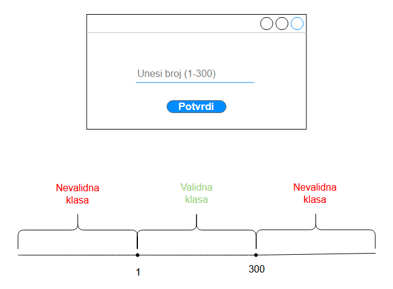
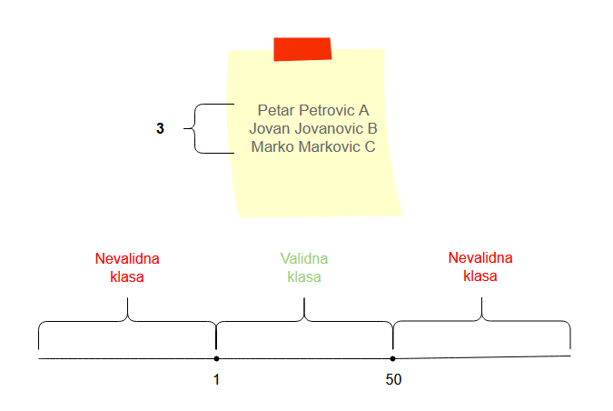
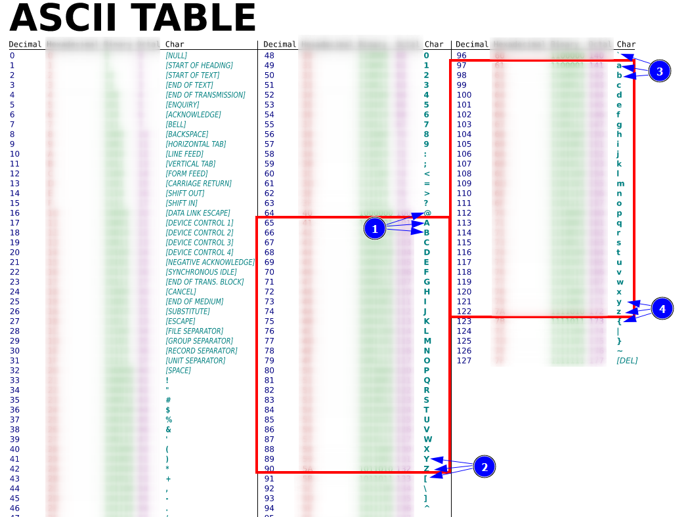

# Testiranje graničnih slučaja

Koristan materijal:
- [Explanation with test examples(ISTQB Foundation Level) (15m51s)][bva - Software Testing 101]
- [Traditional Software Testing Technique (3m44s)][bva - traditional bva]
- [Real World Application and Extension with Exploratory Software (11m3s; opciono)][bva - real world & exploratory testing]

---

Predstavlja tehniku **blackbox** testiranja.

Na engleskom se zove: **Boundary Value Testing** ili **Boundary Value Analysis (BVA)**.

Ideja ove tehnike je da se fokusira na deo klasa ekvivalencije koji često uzrokuje greške u programima.
Taj deo granica klase sa drugim klasama. Na granicama klase programeri često naprave grešku zbog
uključivanja ili isključivanja neke granične vrednosti.

To su na primer slučajevi kada je potrebno koristiti `<=` (manje ili jednako), u kojima programer ne uzme u
obzir (ili pogrešno proceni) slučaj jednakosti pa iskoristi `<`, ili obrnuto, kada je ispravna relacija 
bila `<`, a programer iskoristi `<=`. Isto važi i za slučaj sa relacijama veće `>` i veće i jednako `>=`.

Tehnika particionisanja na klase ekvivalencije podrazumeva nasumično biranje vrednosti iz klase ekvivalencije koji bi
predstavljale tu klasu. Kod BVA se biraju vrednosti na granicama klase. Identifikujemo klase ekvivalencije, a zatim 
za svaku biramo vrednosti oko njihovih granica.

Suština je pre svega da se ispituju slučaji na **granicama (ivicama) klasa ekvivalencije**, slučaj ispod granice,
slučaj iznad granice i slučaj na samoj granici. Ovaj pristup se naziva 3-point BVA. Postoji i 2-point BVA koji se obično 
podrazumeva kada se spomene BVA, ali mi ćemo na ovom kursu podrazumevati da se BVA odnosi na 3-point BVA kada se ne 
naglasi eksplicitno na koji se odnosi. 2-point BVA uključuje samo granične i spoljašnje (nevalidne) vrednosti tih granica.

**BVA je naizgled jednostavna tehnika, ali predstavlja jednu od najkorisnijih tehnika za pronalaženje bagova.**

Postoji više slučaja koji mogu da se tretiraju kao granični slučajevi:
1. granice opsega
2. granice izlaznog opsega
3. granice broja elemenata/entiteta
4. granice izlaznog broja elemenata/entiteta
5. granice sortirane kolekcije

Tehnika se nastavlja na klase ekvivalencije, pa kao što kod njih razmatramo klase ulaza i klase izlaza, 
tako i u ovoj tehnici to činimo.

**Granice opsega** bi predstavljale vrednosti koje se nalaze na krajevima opsega. Na primer, za
opseg `[1, 300]` za testne slučajeve biramo vrednosti koje su oko granica `1` i `300`, odnosno:
- za granicu `1`
  - `0` (vrednost ispod granice)
  - `1` (graničnu vrednost)
  - `2` (vrednost iznad granice)
- za granicu `300`
  - `299` (vrednost ispod granice)
  - `300` (graničnu vrednost)
  - `301` (vrednost iznad granice)

  
|  | 
|:--:| 
| *Granice opsega* |

**Granice izlaznog opsega** imaju istu ideju za određivanje test slučajeva kao i granice opsega, razlika je 
samo to što je reč o izlaznim podacima, a ne o ulaznim. Za svaki izlaz iz programa radimo isto ono što radimo 
i kod granica (ulaznog) opsega. U primeru sa slike je prikazan slučaj za jedan od izlaza programa čiji je
predviđen opseg između `900` i `1600`. Testiramo sledeće slučaje:
- za granicu `900`
  - `899` (ukoliko je moguće)
  - `900` 
  - `901`
- za granicu `1600`
  - `1599`
  - `1600` 
  - `1601` (ukoliko je moguće)

Test slučajevi za slučajeve iz nevalidnih izlaznih klasa ekvivalencije nekada ne mogu da se naprave, ali
bitno je imati na umu i te mogućnosti pri kreiranju test slučajeva.
  
|  | 
|:--:| 
| *Granice izlazni opsega* |

**Granice broja entiteta** bi predstavljale slučaj gde imamo više nekih vrednosti/entiteta. Na primer,
imamo fajl koji može da sadrži od 1 do 50 zapisa. Zapisi bi predstavljali te entitete koje smo spomenuli.
U tom slučaju, posmatramo granice za moguć broj tih entiteta:
- najmanji broj entiteta je `1` pa proveravamo
  - `0` (vrednost ispod granice), tj. slučaj kada nemamo ni jedan zapis
  - `1` (graničnu vrednost)
  - `2` (vrednost iznad granice)
- najveći broj entiteta je `50` pa proveravamo
  - `49` (vrednost ispod granice)
  - `50` (graničnu vrednost)
  - `51` (vrednost iznad granice), tj. slučaj kada se prevaziđe očekivani broj zapisa

  
|  | 
|:--:| 
| *Granice broja entiteta* |

Kod **granica izlaznog broja entiteta** se koristi ista ideja kao i prethodni pristup, samo je reč o izlazu, 
a ne o ulazu. Ako, na primer, imamo program koji vrši pretragu informacija za utakmice koje se trenutno igraju i
kao rezultat vraća maksimalno 10 utakmica, mi možemo da pravimo test slučaje za različit broj vraćenih utakmica.
Imali bismo sledeće slučajeve:
- za minimalan broj, tj. `0`
  - `0`, tj. nije vraćena ni jedna utakmica
  - `1` utakmica
- za maksimalan broj, tj. `10`
  - `9` utakmica
  - `10` utakmica
  - `11` utakmica (ukoliko može da se izvede ovaj ishod tako da se greškom vraća i više utakmica nego što treba)
	

**Granice sortirane kolekcije** su elementi koji se nalaze na krajevima neke sortirane kolekcije, odnosno
elementi koji imaju najmanju i najveću vrednost za funkciju kojom se određuje mesto elementa u kolekciji.
U suštini, to možemo da posmatramo kao prvi i poslednji element sortiranog niza. Primeri u kojima se možemo
sresti sa ovim slučajevima su:
- linearna lista
  - prvi element
  - poslednji element
- tabela
  - prvi red
  - poslednji red
- fajl
  - prva linija
  - poslednja linija

Ideja je da proverimo da li se očekivani element nalazi na tim graničnim pozicijama u specifičnim situacijama.
Na primer, ako dobijemo kao izlaz iz programa fajl koji sadrži sortiran sadržaj, mi možemo da proverimo da li 
je na prvoj i poslednjoj liniji odgovarajući sadržaj. Zatim, ako na primer imamo neki drugi slučaj u kome
se vraća drugačiji sadržaj, mi možemo i u tom slučaju isto da proveravamo, da li linije na krajevima fajla
imaju odgovarajući sadržaj.

---

Ovo nije konačana lista pristupa. Treba biti kreativan i imati određeno znanje o problemu koji se rešava kako bi
se u njemu uočile ovakve mogućnosti u kojima možemo ispitivati neke granice. Više o takvim slučajevima može da se
sazna u trećem video snimku koji se nalazi u "Koristan materijal" na početnu ove stranice.

Rad sa ovom tehnikom se najčešće svodi na pridruživanje rednih brojeva nekakvoj skali, nakon čega se
proveravaju redni brojevi oko granica.

Jedan od interesantnih primera na kojima možemo to uočiti je primer programa koji prihvata kao ulaz slovo. 
U tom primeru, imamo grupu karaktera koji predstavljaju veliko slovo, grupu koja predstavlja malo slovo i
preostale karaktere. Kao prethodno spomenutu skalu možemo koristiti ASCII tabelu. Prva grupa vrednosti sa slike
predstavlja test slučajeve za donju granicu klase velikih slova, druga za gornju granicu, a treća i četvrta
za klasu malih slova.

|  | 
|:--:| 
| *Izvor: [wikimedia.org](https://commons.wikimedia.org/wiki/File:ASCII-Table.svg)* |

Drugi interesantan primer jeste određivanje test slučaja za spektar boja. Kategorije, tj. boje
pretvaramo u skalu. Tom problemu možemo pristupiti na više načina. Jedan je da na boje posmatramo kao RGB 
vrednosti, vrednosti od `0` do `255` za svaku boju, ili kao heksadekadnu vrednost, a onda dodajemo ili oduzimamo
1, čime dobijamo nove boje. Drugi način je da boje predstavimo kao spektar od hladnijim ka toplijim bojama.
Treći način bi bio fizička temperatura boja koja je izražena u kelvinima.

Kada imamo kategorijske podatke, možemo ih na ovaj način uvek konvertovati u nekakvu
skalu na kojoj su vrednosti sortirane pa samim tim možemo odrediti vrednosti u okolini granica.

[#]: / (---------------------------------------------------------)

[bva - Software Testing 101]: https://www.youtube.com/watch?v=lqX6k4I-qAw
[bva - traditional bva]: https://www.youtube.com/watch?v=H6IRY98Gu44
[bva - real world & exploratory testing]: https://www.youtube.com/watch?v=iAZzxk1z0r4