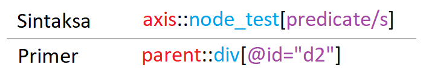
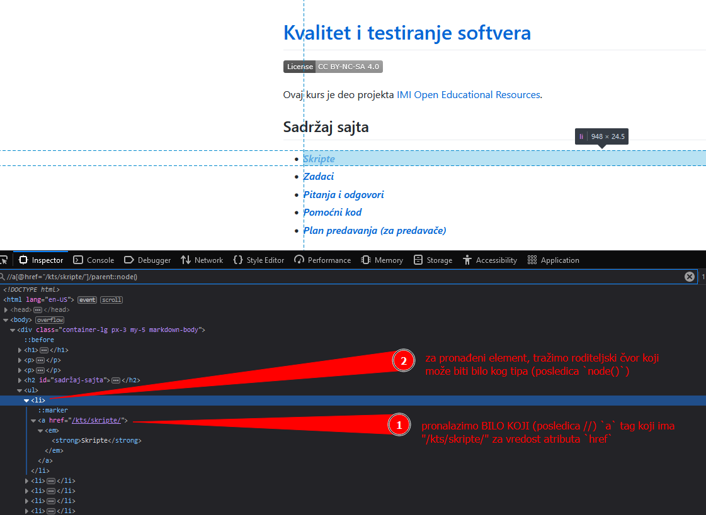
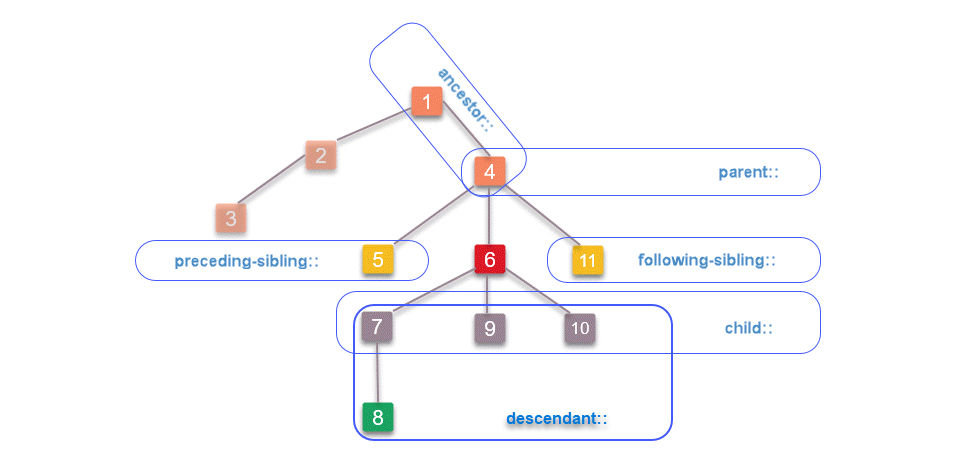
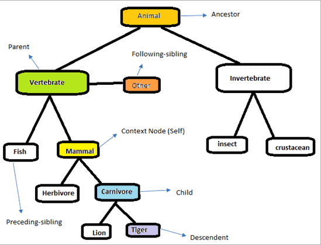

# TestNG & Selenium

Sadržaj:
- [TestNG](#testng)
- [Selenium](#selenium)
  - [XPath](#xpath)
    - [Sintaksa](#sintaksa)
    - [Apsolutni i relativni XPath](#apsolutni-i-relativni-xpath)
    - [Ose](#ose)
    - [Test čvora](#test-čvora)
    - [Predikati](#predikati)
  - [CSS selektori](#css-selektori)
  - [Specifično](#specifično)
  - [Česti problemi](#česti-problemi)
    - [NoSuchElementException](#nosuchelementexception) 
    - [StaleElementException](#staleelementexception) 
    - [ElementNotInteractableException](#elementnotinteractableexception)  
    - [Element is not clickable at point](#element-is-not-clickable-at-point) 
    - [Cannot find BROWSER binary](#cannot-find-browser-binary) 

## TestNG

Koristan materijal:
* [TestNG documentation][testng docs]
* [Selenium Tutorial for Beginners - From Zero to Selenium (26m13s)][testng 4z2s]

---

Pronađeno je puno nedostataka u JUnit-u.

TestNG bogatiji sa mogućnostima u odnosu na JUnit.

**Lako se integriše** sa nekim alatima kao što je Jenkins.

Jedna od glavnih prednosti jeste mogućnost korišćenja **paralelizacije**. 
To nam omogućava da se testovi izvrše brže.

Mogu prosleđivati podaci koji se nalaze izvan testova pomoću 
**konfiguracionih fajlova**. Preko njih možemo i da definišemo koji će 
testovi izvršavati, a koji ne.

Ono što je još njegova prednost jeste mogućnost generisanja specijalizovanih izveštaja.

TestNG dodajemo u `pom.xml` kao dependency. 

Osim njega, dodajemo i dependency za logger pošto bi bez njega dolazilo do upozorenja i grešaka.

---

Test metoda:
```Java
public class StudentTest {
	@Test
	public void kreirajStudenta() {
		// ...
	}
}
```

Umesto korišćenja printova u testu, praktičnije je da se iskoristi loger.
Ispis pomoću logera možemo izvršiti sa `logger.info("Poruka")`.

Instancu logera možemo da kreiramo pomoću factory-a iz zavisnosti koju smo uključili, 
tj. `LoggerFactory` iz `org.slf4j`.

Kreiranje logera:
```Java
// ...
import org.slf4j.Logger;          // obrati pažnju na ovo jer postoji Logger i u nekom drugom paketu
import org.slf4j.LoggerFactory;
// ...

public class StudentTest {
	private static Logger logger = LoggerFactory.getLogger(Logger.class);
	
	// ...
	
	@Test
	public void kreirajStudenta() {
		Student student = new Student("Petar", 1, 2023, 4);
		System.out.println("Ime studenta je: " + student.ime);
		logger.info("Ime studenta je: " + student.ime);
		assertNotNull(student);
	}
	
	// ...
}
```

Možemo i definisati metode koje će biti izvršene pre i/ili posle svakog testa 
(metode koja je označena sa anotacijom `@Test`) pomoću anotacija `@BeforeMethod` 
i `@AfterMethod`. 

Pored tih anotacija, postoji i anotacija `@BeforeClass` koja se postavlja
nad metodom koja će se pozvati **pre nego što se pozove prva testna metoda**. 

Analogno toj anotaciji, postoji i anotacija `@AfterClass` koja se poziva **nakon što su
svi testni metodi izvršeni**.


Ono što je bitno imati u vidu jeste to da je test u TestNG-u **širi pojam** u odnosu na JUnit.
Ne odnosi se na jedan metod, što se u TestNG-u naziva testnim metodom, već na skup testnih
klasa.

Imamo anotacije i za te testove, `@BeforeTest` i `@AfterTest`. Prvom se označava da će 
se metod izvršiti pre nego što se izvrši bilo koja testna metoda iz datog testa (tj. testnih 
klasa koje mu pripadaju).

```Java
public class StudentTest {

    private static Logger logger = LoggerFactory.getLogger(Logger.class);

    Student student;
	
    @BeforeTest
    public void preTesta() {
      logger.info("pre testa");
    }

    @AfterTest
    public void posleTesta() {
		  logger.info("nakon testa");
    }
	
    @BeforeClass
    public void preKlase() {
      logger.info("pre svih testnih metoda testne klase");
    }

    @AfterClass
    public void posleKlase() {
      logger.info("nakon svih testnih metoda testne klase");
    }
	
    @BeforeMethod
    public void setUp() {
      logger.info("pre test metode");
    }

    @AfterMethod
    public void tearDown() {
		  logger.info("nakon test metode");
    }

    @Test
    public void demo1(){
      logger.info("demo1 test");
      assertEquals(10, 10);
    }
	
    @Test
    public void demo2(){
      logger.info("demo 2 - failed");
      assertEquals(10, 1);
    }
}
```

Svi testovi su deo nekog suite-a. Podrazumevani je "Default Suite". Biće više reči o njemu kasnije. 

U TestNG-u postoji i konfiguracija u vidu xml fajla. U njoj možemo npr. definisati koje testne klase
testa želimo da testiramo. Klase koje nismo označili za izvršavanje će biti ignorisane.

Ono što je još bitno kod konfiguracije jeste **parametrizacija testova**.

---

U `test > java` možemo da kreiramo taj konfiguracioni xml fajl. Dobra strana korišćenja xml-a je to 
što se lako menja i tumači, a pre svega to što nakon tih promena mi ne moramo ponovo da kompajliramo
kod što nam olakšava pokretanje testova.

Taj fajl sadrži određenu šemu pa je potrebno na njegovom početnu definisati definiciju tipa dokumenta.
Nakon definisanja tipa dokumenta, možemo koristiti tagove koje TestNG definiše.

Jedan od njih je `<suite>` kojim se definiše suite i ima **obavezni** atribut `name` koji predstavlja
naziv suite-a. 

Unutar njega definišemo testove pomoću taga `<test>` koji ima atribut `name`, a unutar tih testova
niz testnih klasa koje će biti izvršene. Niz se definiše sa tagom `<classes>`, a unutar njega testne klase 
sa tagom `<class>`. Tag za testne klase takođe sadrži atribut `name` i u njemu se definiše **cela putanja**
do date klase.

Unutar taga za testnu klasu možemo da definišemo koje metode želimo da ignorišemo ili samo metode koje
želimo da izvršimo. To radimo unutar taga `<methods>` koji se nalazi u tagu `<class>`. One metode koje nisu 
navedene će biti primenjena **suprotna** akcija. Ako definišemo metode koje ćemo ignorisati, onda će sve druge 
metode biti izvršene, a ako definišemo metode koje želimo da se izvrše, onda će sve druge metode biti ignorisane.

Metode koje jedino **želimo da izvršimo** se definišu tako što se njihovo ime navede u atributu `name` taga `<include>`,
dok se u slučaju **isključivanja (ignorisanja)** koristi tag `<exclude>`.

**Testove pokrećemo biranjem opcije "Run" iz menija koji dobijamo desnim klikom na konfiguracioni fajl.**

Primer konfiguracionog (XML) fajla:
```XML
<!DOCTYPE suite SYSTEM "https://testng.org/testng-1.0.dtd" >

<suite name="Naziv Suite-a">

    <test name="osnovni testovi"   >
        <classes>
            <class name="pmf.imi.StudentTest" />
            <class name="pmf.imi.SaradnikTest">
                <methods>
                    <exclude name="primer4" />
                    <exclude name="primer5" />
                </methods>
            </class>
        </classes>
    </test>

    <test name="neki drugi testovi">
        <classes>
            <class name="pmf.imi.ProfesorTest"></class>
        </classes>
    </test>

</suite>
```

### Parametri

Parametre definišemo u anotaciji `@Parameters`. Prosleđuju se tako što se unutar vitičastih zagrada 
navedu stringovi koji predstavljaju nazive parametara koji su definisani u konfiguracionom fajlu.
Tag za parametar je `<parameter>` i sadrži atribute `name` i `value`.

Anotacija i navođenje naziva:
```Java
@Parameters({"param1", "param2", "param3", "param4"})
public void metod(String par1, String nesto2, String par3, String param4) {}
```

Izgled dela konfiguracionog fajla:
```XML
<suite name="Naziv Suite-a">

  ...

    <test name="osnovni testovi"   >
        <parameter name="param1" value="jedan"></parameter>
        <parameter name="param2" value="dva"></parameter>
        <parameter name="param3" value="tri"></parameter>
        <parameter name="param4" value="cetiri"></parameter>
		
	  ...
		
    </test>
	
  ...
	
</suite>
```

Kao što možemo primetiti, nazivi parametara metoda **ne moraju** da se poklapaju sa nazivima 
parametara testa jer će biti prosleđeni metodu po redosledu u kome su definisani u anotaciji.

[#]: / (Tom metodu možemo proslediti i još neke dodatne parametre nakon ovih koji su definisati.)

U anotaciji navodimo samo one parametre iz konfiguracije koje ćemo proslediti datom metodu 
(ne moraju svi da se navedu). 

**Scope parametara zavisi od toga u kom tagu su definisani**. U prethodnom isečku koda, parametri
su definisani na nivou suite-a.

### Izveštaji

Testovi se mogu izvršavati automatski. Na platformama kao što je GitLab, možemo imati podešen mehanizam
koji će pri svakom merge-u pokrenuti sve testove automatski. Tada je od velikog značaja pregledan i 
jasan izveštaj tog testiranja.

TestNG ima integracije sa svim poznatim sistemima za DevOps kao što je Jenkins. Generisani izveštaji
se mogu videti unutar Jenkins-a.

Izveštaji mogu da se kreiraju i pri pokretnaju nekog testa.

Jedan od izveštaja koji se može kreirati jeste izveštaj u vidu HTML stranice.

U IntelliJ-u, u gornjem desnom uglu kod mesta na kome možemo pokrenuti program biramo "Run Configurations...".
U delu "Configurations" otvorenog prozora imamo više tabova, među kojima je i tab "Listeners". Biramo taj tab 
i dodajemo neki listener na plus. Onaj koji nas zanima jeste neki HTML Reporter. "Reporter" se odnosi na 
klasu kojom menjamo podrazumevani način generisanja izveštaja.

Rezultat će nakon pokretanja biti generisan u folderu `test-output`. U folderu koji se zove kao suite 
će biti generisani HTML fajlovi za svaki test.

## Selenium

Koristan materijal:
* [Selenium Documentation][selenium docs]
* [Guru99 - Selenium Tutorial][selenium guru99]
* [Selenium API Docs][selenium api docs]

---

Selenium simulira interakciju korisnika sa web browser-om. Može da otvori web browser,
simulira klik, pronađe element na stranici, da popuni polje i tako dalje.

To se postiže tako što se pomoću Web Driver-a iz koda kreira i kontroliše instanca web 
browser-a.

Za svaki web browser postoji poseban Web Driver. 

Postoje opcije:
* Firefox
* Edge
* Chrome (na Linux-u Chromium)

Imamo 2 opcije za uključivanje Web Driver-a u projekat:
1. ručno uključivanje i održavanje Web Driver-a za određeni web browser
2. automatsko uključivanje i održavanje Web Driver-a (**zahteva internet konekciju**)

Automatsko uključivanje možemo da obavimo tako što bismo uključili zavisnost . 

[Ovaj pristup je bolji od ručnog zato što ne moramo ručno da preuzimamo izvršni fajl Web Driver-a za odgovarajuću verziju browser-a, operativni sistem i arhitekturu sistema.
Takođe, ne moramo da podešavamo promenljive okruženja, a ni da brinemo o tome da li su nam verzije Web Driver-a i browser-a usklađene nakon ažuriranja.][webdrivermanager]

---

Kako bismo koristili Selenium u svom projektu, neophodno je da kreiramo instancu Web Driver-a.
Obično se u testnoj klasi definiše polje tipa `WebDriver` koje će referencirati instancu Web Driver-a

Instanciranje se najčešće odvija u 2 koraka, odnosno u 2 metode:
1. pošavanje putanje do izvršnog fajla WebDriver-a u `@BeforeSuite` metodi, ili pozivanje setup web menadžera kod automatskog pristupa
2. instanciranje Web Driver-a u `@BeforeMethod`, kako bi se napravio novi pre svakog testa

Primer:
```Java
public class DemoTest {
	private static Logger logger = LoggerFactory.getLogger(Logger.class);

	WebDriver driver;

	@BeforeSuite
	public void beforeSuite() {
		WebDriverManager.edgedriver().setup();
	}
	
	@BeforeMethod
	public void beforeMethod() {
		driver = new EdgeDriver();
	}
	
	@Test
	public void navigateToWebAdress() {
		String url = "https://imioer.github.io/kts/";
		
		driver.get(url);
		String currentUrl = driver.getCurrentUrl();
		
		logger.info(currentUrl);
		logger.info(driver.getTitle());
		
		assertEquals(currentUrl, url);
	}
}
```

Instanca `WebDriver`-a ima više nekih metoda pomoću kojih možemo da interagujemo
sa stranicom, kao i metoda pomoću kojih možemo doći do nekih informacija.

Sa `driver.getCurrentUrl()` dolazimo do trenutne URL adrese, a preko
`driver.getTitle()` možemo dobiti title trenutne stranice.

Nakon build-a projekta, dolazi kreira instanca Edge-a i njegovom otvaranja.

Kada se sve učita, test se dalje nastavlja i vriši se validacija trenutnog
URL-a.

Treba primetiti da nakon obavljenog testa web browser još uvek ostaje
otvoren. Ukoliko bismo pokrenuli test još nekoliko puta, imali bismo
više aktivnih instanci browser-a. 

Da bismo ovo sprečili, gasimo kreirani web browser nakon svakog izvršenog
testnog metoda:
```Java
@AfterMethod
public void afterTestMethod() {
	driver.quit();
}
```

Pored metoda `quit()` postoji i metod `close()` kojim se zatvara trenutni prozor ili tab.

Često se koristi i maksimizacija prozora browser-a jer na određenim dimenzijama prozora može
doći do izmene strukture stranice. Maksimizaciju vršimo sa: `driver.manage().window().maximize()`.

---

Spomenuli smo da pomoću Seleniuma možemo vršiti i kompleksnije operacije kao 
što je unos u neko polje i klik na dugme.

Da bismo to odradili, potrebno je da se pronađu odgovarajući elementi, a to 
radimo pomoću lokatora.

Postoji više tipova lokatora, tj. strategija lociranja elemenata.

Osnovna klasa u procesu lociranja elementa je klasa `By`. Pomoću njenih statičnih
metoda se definiše **uslov** pretrage. Ono što ti metodi rade jeste samo definisanje 
uslova, a to **ne uključuje i pronalaženje** datog elementa. Da bismo pronašli element,
dati uslov prosleđujemo dalje Web Driver-u preko njegovih metoda `findElement` i 
`findElements`. Odabir neke od te 2 metode zavisi od toga broja elemenata koji 
očekujemo. Rezultat je instanca klase `WebElement`.

**Pri lociranju elementa, bitno je da rezultat bude jedinstven.** Ako ih ima više, prvi 
će biti izabran. Zbog toga, kada analiziramo stranicu, trudimo se da biramo ono
što dati element jedinstveno identifikuje. Ako ne možemo direktno da ga identifikujem,
onda ga identifikujemo indirektno preko drugih elemenata koje možemo direktno identifikovati.
To uglavnom radimo definisanjem detaljnijih opisa kojima se opisuje gde se dati element nalazi
u odnosu na onaj element do koga možemo lako doći.

Elementu možemo proslediti string pomoću metode `sendKeys`. Time se samo unosi
nešto u taj element, tj. polje koje on predstavlja. 

Dodatno je potrebno i submit-ovati unos pomoću `submit` metode elementa. To možemo
odraditi i slanjem novog reda.

Submit nas vodi na novu stranicu pa je poželjno utvrditi i da li je došlo do prelaska
na odgovarajuću stranicu.

Primer:
```Java
@Test
public void testSearchPattern(){
	driver.get("https://www.tehnomedia.rs/");

	By elementSearchBy = By.id("search-text");
	WebElement input = driver.findElement(elementSearchBy);

	input.sendKeys("monitor");
	input.submit();

	assertTrue(driver.getCurrentUrl().endsWith("/search/find.html?rec=monitor"));
}
```

Pri validaciji rezultata **poželjno je da se proveri da li rezultat pretrage nije `null`**.

Takođe, ukoliko proveravamo da li se na stranici nalazi odgovarajući string, nije loše
koristiti metodu `trim` nad tim string-om (actual).

---

Ukoliko sada želimo da testiramo stranicu koja predstavlja rezultat pretrage, ne moramo ponovo 
vršimo akcije koje dovode do tog rezultata, već **možemo da iskoristimo adresu (URL) tog rezultata**, 
tj. `https://www.tehnomedia.rs/search/find.html?rec=monitor` iz prethodnog primera, i početi rad od te adrese. 
U prethodnom primeru to možemo da odradimo jer URL sadrži query deo koji nam daje dati rezultat, 
ali to **ne možemo uvek raditi** jer neke stranice ne šalju upit serveru za neke rezultate preko URL, već
to možda rade preko tela zahteva.

---

Ukoliko koristimo `driver.findElements(uslov)`, očekujemo kao rezultat list 
elemenata, tj. `List<WebElement>`. Dobijeni rezultat možemo da testiramo tako 
što bismo proverili da li smo dobili očekivani broj elemenata i to radimo 
poređenjem očekivanog broja sa brojem elemenata dobijene liste.

---

Za uslova za lociranje elemenata sem `By.id` možemo koristiti i:
* `By.name` - `name` atribut tag-a
* `By.className` - klasa taga (vrednost `class` atribut tag-a)
* `By.tagName` - ime tag-a
* `By.linkText` - tekst linka (tekst koji predstavlja link na stranici)
* `By.partialLinkText` - deo tekst linka (teksta koji predstavlja link na stranici)
* `By.cssSelector`
* `By.xpath`

### XPath

Koristan materijal:
* [w3schools: XPath Introduction][w3s xpath intro]
* [w3schools: XPath Syntax][w3s xpath syntax]
* [Wikipedia: XPath][wiki xpath]
  * Abbreviated syntax (informativno, radi boljeg razumevanja)
  * Expanded syntax (informativno, radi boljeg razumevanja)
  * Axis specifiers
  * Node tests "Other node test formats"
  * Predicates
  * Functions and operators
    * poželjno je da se zapamti: 
      * `position()`, 
      * `count(node-set)`, 
      * `concat(string, string, string*)`, 
      * `starts-with(s1, s2)`, 
      * `contains(s1, s2)`, 
      * `substring(string, start, length?)`
* [Mastering XPath for Selenium Test Automation Engineers][pragmatictestlabs xpath]
* [IONOS: XPath Tutorial for Beginners][ionos xpath]
* [XPath Tester - Free Online Toolbox for developers][xpath tester]
* [XPath Cheatsheet][xpath cheatsheet]
* [XPath with multiple conditions (opciono)][xpath multiple conditions]
  
---

Skraćeno za: **XML Path Language**.

Predstavlja jezik pomoću kojeg je moguće vršiti **navigaciju i selekciju** čvorova u stablu koje predstavlja XML dokument. 
Možemo i definisati dodatne kriterijume (predikate) za putanje u tom stablu i time filtriramo putanje.

S obzirom da je i HTML markup jezik sa sličnom strukturom kao XML, XPath takođe možemo koristiti i za pronalaženje
elemenata u HTML-u.

Obično ga koristimo kada ne možemo da nađemo element preko lokatora kao što su id, name i class.

XPath izraz se sastoji iz 3 dela:
1. ose (axis)
2. testa čvora (note test)
3. predikata (predicate)



Izraz se evaluira u odnosu na trenutni **kontekstni čvor (context node)**. Osa nam definiše **smer navigacije u odnosu na kontekstni čvor**,
a test čvora i predikat se koriste za **filtriranje** čvorova koji se nalaze na smeru koji je definisan osom, tj. ako nam osa kaže da je
navigacija usmerena ka potomcima kontekstnog čvora, onda oni filtriraju te potomke na definisan način.

U Seleniumu koristimo `By.xpath(xpath_izraz)` kako bi definisali uslov za pronalaženje elementa pomoću XPath-a. Ukoliko imamo string unutar 
`xpath_izraz`, možemo da escape-ujemo navodnike ili da koristimo jednostruki navodnik.

#### Sintaksa

Postoje 2 sintakse za XPath izraze:
1. Skraćena sintaksa (Abbreviated syntax)
2. Proširena sintaksa (Expanded syntax)

**Skraćena sintaksa** je konciznija i intuitivnija. Može lakše da za zapiše i pročita.

Primer za `https://imioer.github.io/kts`: 
```XPath
//a[@href="/kts/skripte/"]/em/strong
```

**Proširena sintaksa** omogućava deskriptivniji i specifičniji opis. Teža je za čitanje, ali nam može omogućiti neke opcije koje 
nam nisu dostupne u kraćoj sintaksi.

Primer za `https://imioer.github.io/kts`: 
```XPath
descendant-or-self::a[@href="/kts/skripte/"]/child::em/child::strong
```

U oba primera smo selektovali element (tag) `strong`.

---

Skraćeni oblik u stvari implicitno koristi `child` kao podrazumevanu osu kada koristimo `/`, što možemo i primetiti 
iz prethodnih primera. Time XPath izraz može da se zapiše kraće, bez navođenja ose.


XPath izrazi **mogu da kombinuju** ove sintakse.

Ukoliko u prethodnom primeru želimo da dođemo do elementa čije je spomenuti tag `a` dete, to možemo učiniti kombinacijom ove dve sintakse:
```XPath
//a[@href="/kts/skripte/"]/parent::node()
```



Neki načini na koji smo još ovo mogli da odradimo (prikazano samo radi ilustracije, a kasnije će biti objašnjeno detaljnije):
* `//ul/li` (nije preporučljiv jer je dosta uopšteno)
* `//a[@href="/kts/skripte/"]/..` (isto što i originalni izraz; `..` je skraćeni zapis za `parent::node()`)
* `//*[@href="/kts/skripte/"]/..` (varijanta prethodnog izraza, sa opširnijim testom čvora)
* `/html/body/div/ul/li[1]` (apsolutni XPath; nije preporučljiv jer lako može da postane nevalidan ukoliko se promeni struktura stranice pre tog elementa)
* `//*[@id="sadržaj-sajta"]/following-sibling::node()/li`
* `//li[child::a[@href="/kts/skripte/"]]`
* `//li[./a[@href="/kts/skripte/"]]`

#### Apsolutni i relativni XPath

**Apsolutna putanja** predstavlja putanju od korenog čvora (root node) do nekog elementa. To je direktna putanja do elementa.

Primer selektovanja elementa `strong` pomoću apsolutne putanje:
```XPath
/html/body/div/ul/li[1]/a/em/strong
```

Mana ovih putanja je to što bilo koja izmena na toj putanji zahteva i ažuriranje izraza. Do tih promena može doći pri pomeranju datog elementa na
stranici, pri brisanju ili dodavanju nekog predaka i tako dalje. Takve promene se mogu dešavati često ili bar više puta, što zahteva da nakon **svake
promene** ažuriramo izraz, a to nam otežava održavanje testnog koda.

Druga mana je kompleksan i dugačak zapis koji se teško može tumačiti i kreirati. Dati primer apsolutne putanje nije mnogo duži od relativne putanje jer
se element nalazi na relativno maloj dubini, ali kada se element nalazi na nekoj većoj dubini u DOM-u, može se primetiti da je apsolutna putanja 
značajno duža.

U Firefox-u, do apsolutne putanje elementa možemo da dođemo tako što u Inspector-u (DevTools) desnim klikom na element dobijemo meni i zatim `Copy > XPath`.

**Relativna putanja** predstavlja putanju od kontekstno (trenutnog) čvora do nekog elementa. Otpornija je na izmene u odnosu na apsolutnu putanju
jer je prostor/obim u kome može doći do promene znatno manji. Prednost je i to što je izraz kraći pa se lakše može čitati, a takođe se i lakše
tumači jer se obično ne koriste pozicije elemenata.

Primer selektovanja elementa `strong` pomoću relativne putanje:
```XPath
//a[@href="/kts/skripte/"]/em/strong
```

#### Ose

<span style="color: red; font-size: 40px">Izrada u toku</span>


|  | 
|:--:| 
| *Izvor: [pragmatictestlabs.com](https://pragmatictestlabs.com/2020/01/28/mastering-xpath-for-selenium-test-automation-engineers)* |

|  | 
|:--:| 
| *Izvor: [softwaretestinghelp.com](https://www.softwaretestinghelp.com/xpath-axes-tutorial)* |


#### Test čvora

<span style="color: red; font-size: 40px">Izrada u toku</span>

| Moguća vrenodst           | Opis                                                             |
|---------------------------|------------------------------------------------------------------|
| html tag `tag`            | Bira sve **`tag`** čvorove na odabranoj osi (npr. anchor tag `//a`)                     |
| `*`                       | Bira sve čvorove na odabranoj osi                                |
| `node()`                  | Bira sve čvorove na odabranoj osi                                |
| `text()`                  | Bira sve **tekstualne** čvorove na odabranoj osi                 |
| `comment()`               | Bira sve čvorove **komentara** na odabranoj osi                  |
| `processing-instruction()`| Bira sve čvorove **instrukcija za procesiranje** na odabranoj osi|


#### Predikati

<span style="color: red; font-size: 40px">Izrada u toku</span>


### CSS Selektori

Koristan materijal:
* [w3schools CSS Selectors][w3s css selectors]
* [Mastering CSS for Selenium Test Automation Engineers][pragmatictestlabs css]

---

Neki CSS selektori:
* `#identifikator` - tag čiji atribut `id` ima vrednost `identifikator`
* `.klasa` - tag čiji atribut `class` ima vrednost `klasa`
* `tag1 tag2` - selektovanje svih `tag2` unutar `tag1` (bilo gde u njegovoj hijerarhiji)
* `tag1, tag2` - selektovanje svih `tag1` i `tag2` (posmatra ih nezavisno)
* `tag1 > tag2` - selektovanje svih `tag2` koji se direktno nalaze unutar `tag1` (direktni potomci, a ne potomci potomaka)
* `tag.klasa` - selektovanje tagova `tag` koji imaju vrednost `klasa` za atribut `class`

Možemo ih i kombinovati, npr. `tag1.klasa > tag2` čime selektujemo sve `tag2` koji se nalaze
direktno unutar nekog `tag1` taga koji ima atribut `class` setovan na `klasa`.

### Specifično

Ako želimo da radimo sa padajućim menijem (dropdown-om), potrebno je da koristimo klasu `Select`. Razlog je to što
`WebElement` koji je vraćen od strane `findElement` i `findElements` definiše interfejs za rad sa bilo kojim elementom.

Da bismo koristili metode koji su specifični za dati element, odnosno select u ovom slučaju. Konstruktoru se prosleđuje
`WebElement` i referencu dobijene instance klase `Select` čuvamo promenljivoj iste te klase. Pomoću nje možemo pristupiti
odgovarajućim metodama i da, na primer, selektujemo i deselektujemo opcije na osnovu teksta (sadžaja `innerHTML`-a) ili na 
osnovu vrednosti opcije (sadržaja `value` atributa).


---

Lokatori koji se odnose na linkove ne možemo koristiti na kompleksnijim sajtovima koji umesto anchor taga, tj. `a`, koriste
JS listener-e na nekim elementima. Tada moramo koristi neki alternativni pristup kao što je pronalaženje elementa i klik na
njega.

### Česti problemi

* [Selenium Docs: Understanding Common Errors][selenium troubleshooting]

---

#### NoSuchElementException

Koristan materijal:
* [Let's Kode It: How To Handle No Such Element Exception (15m39s)][selenium exceptions no such element - Let's Kode It]

---

**Element ne može da se pronađe u datom trenutku.**

Najčešće se javlja kada se pretraga za elementom završi neuspešno kao greška uzrokovana 
pogrešno sa pokrešno definisanim lokatorom. Dešava se i da element nije na mestu na kome
ga tražimo ili nije prisutan u datom trenutku na mestu na kome ga tražimo.

Mogućih razloga za dobijanje ovog exception-a su i:
* pretraga (`findElement/s`) se završila pre nego što je obavljeno render-ovanje stranice
* element se nalazi u **drugom tab-u**
* element se nalazi na **drugom prozoru**
* element se nalazi unutar `frame` ili `iframe`
* element se nalazi unutar [**Shadow DOM-a**][shadow dom]

Rešenja:
1. čekanje (implicitno ili eksplicitno), ukoliko je problem sa trenutnom u kome je izvršena pretraga
2. prelazak pomoću `driver.switchTo()`, ukoliko se element nalazi u drugom tabu, prozoru ili frame-u
3. prelazak u Shadow DOM ukoliko se element nalazi u njemu:
   ```Java
      SearchContext shadowRoot = shadowContainer.getShadowRoot();
      WebEleemnt element = shadowRoot.findElement(...);
      ``` 

#### StaleElementException

Koristan materijal:
* [Let's Kode It: How To Handle Stale Element Exception (5m31s)][selenium exceptions stale - Let's Kode It]
* [Selenium Stale Element Exception with Code Example (14m14s)][selenium exceptions stale]

---

**Element je prethodno pronađen, ali referenca više ne važi jer sada preko nje ne možemo da mu pristupimo.**

Dešava se da dođe do nekih izmena nakon lociranja elementa i da ono što smo prethodno pronašli
više nije validno.

Mogući uzroci:
* stranica je osvežena
* pronađeni element je **obrisan** u nekom trenutku pa sada referenca na njega 
  (`WebElement`) ne važi
* pronađeni element je **premešten** u nekom trenutku pa sada referenca na njega ne važi
* element je **obrisan i potom zamenjen** istim ili sličnim elementom (može i da ima isti id)
* element je **pronađen, a potom smo prešli na drugo mesto, tj. kontekst** (stranicu, prozor, tab, frejm, ...)

**Ukoliko dođe do problema zbog promene DOM-a, možemo pronaći element opet**. To nije baš efikasno
i još uvek postoji verovatnoća da opet dođe do ove greške sa datim elementom, ali period u kome
ona može da nastane je veoma kratak pa je time i verovatnoća znatno mala. Drugo rešenje je
da taj element **wrap-ujemo unutar nekog objekta koji čuva lokator elementa i kešira ga.** 
Tada će ovaj objekat ponovo pronaći element kada postane stale (nevalidan). To možemo odraditi 
sa anotacijom `@CacheLookup`. Ovo rešenje je efikasnije.

Ukoliko dođe do promene konteksta, potrebno je da se **vratimo nazad** jer je referenca još uvek
validna, ali ukoliko promenimo stranicu potrebno je i da **ponovo lociramo** element jer je
prethodni kontekst obrisan.

#### ElementNotInteractableException

Koristan materijal:
* [Let's Kode It: How To Handle Element Not Interactable Exception (14m34s)][selenium exceptions not interactable - Let's Kode It]
  * prikazuje razne uzroke koji mogu izazvati ovu grešku, a o kojima se ne priča toliko često
* [Selenium Element Not Interactable Exception wtih Python & Java Code Examples (9m20s; opciono)][selenium exceptions not interactable]
  * uglavnom se rešava čekanjem da se element prikaže ili bude dostupan za interakciju

---

Najčešće se javlja:
1. kada je element sakriven ili onemogućen ili 
2. kada se nad elementom vrši akcija koju ne podržava

**Vršenje nepoznate akcije se može dogoditi i greškom**. Na primer, koristimo id za lociranje 
elementa. Mi očekujemo da je jedinstven i da jednoznačno određuje element, ali to
ne mora biti uvek slučaj. **Stranica može da sadrži više elemenata sa istim id-jem**, iako
je pravilo da se to ne radi. U ovakvoj situaciji, lociran je prvi element sa koji ima
dati id, pa se može dogoditi da mi nad tim pogrešnim elementom izvršavamo akciju koja nije
podržana (npr. unos teksta u element koji predstavlja labelu).

Može se javiti, ali ređe, i:
* kada je element u DOM-u prisutan, ali nije prikazan (već mora da se skrola do njega da bi se video)
* kada ga neki element prekriva

#### Element is not clickable at point

Koristan materijal:
* [Let's Kode It: How To Handle Element Not Clickable At Point Exception (12m36s)][selenium exceptions not clickable - Let's Kode It]

---

Mogući uzroci:
1. element je onemogućen
2. element još uvek nije dostupan (učitan)
3. element se preklapa sa drugim elementima

Rešenja:
1. omogućavanje kroz neku interakciju sa stranicom (ukoliko je moguće)
2. čekanje, implicitno ili eksplicitno, na dati element (visibility, presence, ..) ili element koji ga preklapa (invisibility, ...)
3. uklanjanje elementa (koji preklapa dati element) kroz neku interakciju (npr. zatvaranje popup-a)

Neke stvari koje nam još mogu pomoći su:
* `JavascriptExecutor`-a za scroll i/ili klik
* maksimizacija stranice (`driver.manage().window().maximize()`) kako bi se rasporedili elementi i smanjilo preklapanje
* korišćenje klase `Actions`


#### Cannot find BROWSER binary 

Poruka je ovog oblika (za `ChromeDriver`):
```Console
org.openqa.selenium.SessionNotCreatedException: Could not start a new session. Response code 500. Message: unknown error: cannot find Chrome binary 
```

Ova greška se javlja kada:
* putanja do izvršnog fajla browser-a nije dobro podešena
* browser nije instaliran na datom sistemu
* verzije driver-a i browser-a nisu kompatibilne


[#]: / (---------------------------------------------------------)

[testng docs]: https://testng.org/doc/documentation-main.html
[testng 4z2s]: https://www.youtube.com/watch?v=keEQPUG0CC8

[selenium docs]: https://www.selenium.dev/documentation/overview
[selenium api docs]: https://www.selenium.dev/selenium/docs/api/java/org/openqa/selenium/WebDriver.html
[selenium guru99]: https://www.guru99.com/selenium-tutorial.html

[selenium exceptions - 4 common exceptions]: https://www.youtube.com/watch?v=93RGwXY6b6c
[selenium troubleshooting]: https://www.selenium.dev/documentation/webdriver/troubleshooting/errors

[selenium exceptions no such element - Let's Kode It]: https://www.youtube.com/watch?v=y6SYtAh-kCk

[selenium exceptions stale]: https://www.youtube.com/watch?v=Yb_2u6BWYE4
[selenium exceptions stale - Let's Kode It]: https://www.youtube.com/watch?v=yYQrtmNn6Uo

[selenium exceptions not interactable - Let's Kode It]: https://www.youtube.com/watch?v=e2tSki_Ossc
[selenium exceptions not interactable]: https://www.youtube.com/watch?v=czzbm4bHI0w

[selenium exceptions not clickable - Let's Kode It]: https://www.youtube.com/watch?v=iaI1vcEAWlM

[webdrivermanager]: https://bonigarcia.dev/webdrivermanager/#motivation

[w3s css selectors]: https://www.w3schools.com/cssref/css_selectors.php
[pragmatictestlabs css]: https://pragmatictestlabs.com/2021/01/05/mastering-css-for-selenium-test-automation-2

[w3s xpath intro]: https://www.w3schools.com/xml/xpath_intro.asp
[w3s xpath syntax]: https://www.w3schools.com/xml/xpath_syntax.asp
[wiki xpath]: https://en.wikipedia.org/wiki/XPath
[pragmatictestlabs xpath]: https://pragmatictestlabs.com/2020/01/28/mastering-xpath-for-selenium-test-automation-engineers
[ionos xpath]: https://www.ionos.com/digitalguide/websites/web-development/xpath-tutorial
[xpath tester]: https://extendsclass.com/xpath-tester.html
[xpath cheatsheet]: https://devhints.io/xpath
[xpath multiple conditions]: https://stackoverflow.com/questions/10247978/xpath-with-multiple-conditions

[shadow dom]: https://www.lambdatest.com/blog/shadow-dom-in-selenium