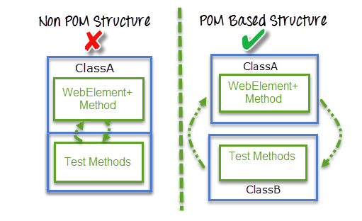
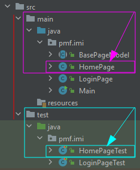
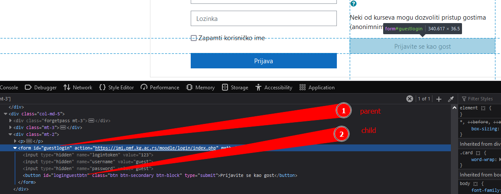

# POM & PageFactory

Sadržaj:
* [Page Object Model (POM)](#page-object-model-pom)
* [PageFactory](#pagefactory)
  * [FindBy](#findby)
  * [FindBys](#findbys)
  * [FindAll](#findall)

## Page Object Model (POM)

Koristan materijal:
* [Selenium Page Object Model tutorial for beginners (5m27s)][pom - intro]
* [Selenium automation: How to use Page object model in Selenium Automation Testing (11m58s)][pom - how2use]
  * na vežbama smo imenovali klase sa `<ImeStranice>` i `<ImeStraniceTest>`, a u ovom snimku su te klase nazvane istim imenom, pri čemu se klasa stranice importuje sa `<naziv_paketa>.<ImeStranice>` (`Pages.Golf`)
* [Selenium Docs: Page object models][pom - selenium docs]
* [How To Perform End To End Testing With Selenium (1h9m15s; opciono)][selenium e2e lambdatest]
  * u ovom video su korišćeni POM i wrapper-ske funkcije (njih nismo pominjali):
    > It’s always a good idea to wrap third-party libraries into your own abstractions since this prevents these 
    > dependencies leaking throughout your framework and is a way to write clean code ...
    >
    > Instead, It is much better to write wrapper functions over WebDriver methods in a BasePage class and either
    > inherit or compose this in all your page objects. This way, if anything changes, you have to make these 
    > changes in a single place instead of fixing these in multiple places. This very nicely adheres to the DRY 
    > (Don’t repeat yourself) principle which is considered a very good programming practice  
    > 
    > [Izvor: https://blog.testproject.io](https://blog.testproject.io/2020/10/06/common-mistakes-in-test-automation)
---

Predstavlja **dizajn pattern** u automatskom testiranju.

Razlog za njegovo korišćenje je olakšavanje održavanja testnog koda
i smanjenje ponavljanja istog koda. 

Ako dođe do promene lokatora, promena treba da se odradi 
**samo na jednom mestu**.

Ideja je da se za svaku web stranicu napravi po jedna klasa koja opisuje tu stranicu. 

Instanciranjem pravimo objekte koji bi predstavljali jednu stranicu i pozivanjem metoda tog objekta 
vršimo neku interakciju sa stranicom. 

**Korišćenje tih klasa koje predstavljaju stranice vršimo u testnim klasama.** Kod trebamo strukturirati tako da imamo page klase 
(klase stranica) i test klase, čime **ne mešamo** opis stranice 
sa njenim testnim kodom. Ako dođe do promene UI-a, potrebno je 
promeniti **samo kod klase stranice**, dok bi testni kod mogao da ostane 
**nepromenjen** pošto koristi API te klase. To nam omogućava lako 
održavanje koje je pomenuto u uvodu.

|  | 
|:--:| 
| *Izvor: [guru99.com](https://www.guru99.com/page-object-model-pom-page-factory-in-selenium-ultimate-guide.html)* |


> If you have WebDriver APIs in your test methods, You’re Doing It Wrong.  
> – **Simon Stewart (creator of Selenium WebDriver)**

> Page objects themselves should never make verifications or assertions. 
> This is part of your test and should always be within the test’s code, never in an page object.
>
> ---
>
> There is one, single, verification which can, and should, be within the page object and 
> that is to verify that the page, and possibly critical elements on the page, were loaded 
> correctly. This verification should be done while instantiating the page object.
>  
> [Izvor: https://www.selenium.dev][pom - selenium docs]

Svi elementi stranice i metode za interakciju sa njima se nalaze u 
samoj klasi koja se nalazi negde u `main` paketu, a onda objekat takve
klase koristimo unutar testne klase koja se nalazi u `test` paketu.



**Pre svakog testa pored instanciranja novog driver-a instanciramo i
odgovarajuće klase stranica koje želimo da testiramo**. Reference na njih
čuvamo kao polja testne klase, kojima zatim možemo da pristupimo iz 
testnih metoda.

---

|  | | 
|:--:|:--| 
| **Property (field) klase** | element na stranici (nešto što je opisuje), tačnije njegov `By` |
| **Metoda klase**           | simulacija akcije korisnika                |

Na primer, property je link na stranici, a metoda klik na taj link.

Po konvenciji, promenljiva `By` se naziva tako da se naziv završava sa `By`, npr. `inputFieldBy`.

Praktično je da se `By` **odmah instancira**.

Metode su **javne**, a propertiji **privatni**.

**Navigacione metode trebaju da vrate objekat klase koja predstavlja stranicu**. 
Zašto? Zato što nam to omogućava da vršimo provere nad tom
stranicom na koju smo došli. Ona može npr. imati metodu koji nam daje
title te stranice, pa korišćenjem nje možemo da proverimo da li je 
postavljen odgovarajući string za taj title.

---

Negde u nekim tutorijalima na internetu se pored stranica vraćaju i link. To je **loša praksa** jer se u konstruktoru stranice može naći neka provera, npr. tog link-a, pa
ako dođe do promene u URL (promeni se endpoint ili domen), biće potrebno da se menja
string linka u svakom testu koji ih prosleđuje.


## PageFactory

Koristan materijal:
* [SeleniumHQ/selenium Wiki: PageFactory][pagefactory - selenium wiki]
* [Selenium Easy: Page Factory Design Pattern (Enhanced POM)][pagefactory - seleniumeasy]
* [Page Object Model (POM) With Page Factory | Selenium Tutorial][pagefactory - softwaretestinghelp]

---

Predstavlja Selenium-ov built-in način za implementaciju POM-a.

Razlozi za njegovo korišenje su automatsko instanciranje elemenata i mogućnost pisanja 
čitkijeg koda pošto se ne koriste metode `findElement` i `findElements`.

Ono što nam još nudi je jednostavno pisanje nekih kompleksnijih pretraga, keširanje
elemenata (`@CacheLookup`) i mogućnost lazy loading-a pri automatskom instanciranju 
(`AjaxElementLocatorFactory`).

Razlika u odnosu na POM opisan u prethodnom poglavlju je to što se u okviru stranici 
sada čuvaju elementi (`WebElement`), a ne `By`-evi, i to što inicijalizaciju vršimo
samo na jednom mestu pomoću `PageFactory.initElements`.

Inicijalizacija svih elemenata (označenih odgovarajućim anotacijama) se može obaviti sa:
* `PageFactory.initElements(driver, this)` ako to radimo unutar klase čije elemente inicijalizujemo, ili
* `PageFactory.initElements(driver, ImeKlaseStranice.class)` ukoliko to radimo izvan te klase.

Najčešće se radi u konstruktoru BasePageModel-a (klase koje nasleđuju sve druge page klase).

Ukoliko je ne obavimo, doći će do `NullPointerException`-a jer dati web element nije
inicijalizovan.

### FindBy

Zamenu za `findElement` i `findElements` nam predstavlja anotacija `@FindBy`.

Pomoću nje se vrši pronalazak elementa tako što u njoj definišemu način na koji
će element biti lociran, a onda se pri pozivu `PageFactory.initElements` izvrši
inicijalizacija svih elemenata koji imaju definisanu ovu anotaciju.

U ovoj anotaciji, lokator se može definisati na 2 načina:
1. pomoću `how` i `using` (oba moraju biti definisana)
2. pomoću `id`, `name`, `className`, `css`, `xpath`, `tagName`, `linkText` ili `partialLinkText`

Prvi način:
```Java
@FindBy(how = How.ID, using = "username") 
private WebElement userName;
```

`how` definiše tip lokatora pomoću `How` enuma, a `using` izraz koji za taj tip lokatora.

Drugi način:
```Java
@FindBy(id="username")
private WebElement userName;
```

Jedna od dodatni funkcionalnosti u odnosu na `findElement` i `findElements` je to što
pomoću prvog načina mi možemo da iskoristimo i strategiju `How.ID_OR_NAME` kojom definišemo
da izraz može važiti za id ili za ime.

Kada želimo da prihvatimo više od 1 elementa, menjamo tip u listu:
```Java
@FindBy(tagName = "a") 
private List<WebElement> links;
```

### FindBys

Koristan materijal:
* [Stackoverflow: FindBys][findbys: stackoverflow]
* [Selenium API Docs: FindBys (opciono)][findbys: selenium docs]
* [Selenium API Docs: ByChained (opciono)][findbys: selenium docs bychained]

---

Izvršava seriju `FindBy` operacija, jednu za drugom. Svaki nađeni element predstavlja polaznu tačku za sledeću pretragu.

Primer:
```Java
// URL: https://imi.pmf.kg.ac.rs/moodle/login/index.php
@FindBys({
    @FindBy(id = "guestlogin" ),
    @FindBy(id = "loginguestbtn")
})
private WebElement btn;
```



Broj nije ograničen samo na 2 `FindBy`-a. Prethodni primer smo mogli da zapišemo i na sledeći način:
```Java
// URL: https://imi.pmf.kg.ac.rs/moodle/login/index.php
@FindBys({
        @FindBy(xpath = "//div[@class='mt-2']"),
        @FindBy(id = "guestlogin"),
        @FindBy(id = "loginguestbtn")
})
private WebElement btn;
```

Moguće je i sledeće:
```Java
// URL: https://imi.pmf.kg.ac.rs/moodle/login/index.php
@FindBys({
    @FindBy(xpath = "//div[@class='mt-2']"),
    @FindBy(id = "loginguestbtn")
})
private WebElement btn;
```

Rad ove anotacije se može posmatrati kao:
```Java
// URL: https://imi.pmf.kg.ac.rs/moodle/login/index.php
WebElement guestLogin = driver.findElement(By.id("guestlogin"));
WebElement btn = guestLogin.findElement(By.id("loginguestbtn")); // obratiti pažnju: koristi se guestLogin.findElement, a ne driver.findElement
```

### FindAll

Pronalazi elemente koji zadovoljavaju **bilo koji** `@FindBy` koji je definisan u listi.

Primer:
```HTML
<!-- URL: https://imi.pmf.kg.ac.rs/moodle/login/index.php -->
<button class="btn btn-secondary btn-block" type="submit" id="loginguestbtn">Prijavite se kao gost</button>
```

Rešenje:
```Java
@FindAll({
    @FindBy(class = ".btn.btn-secondary"),       // nema poklapanja: fali `.btn-block`
    @FindBy(xpath = "//buton[@type='submit']")   // poklapanje
    @FindBy(id = "loginguestbtn")                // poklapanje
    @FindBy(xpath = "//buton[.='Prijavite se']") // nema poklapanja: fali ` kao gost`
})
private WebElement btn;
```

Dolazi do pronalaska button-a jer barem jedno poklapanje.

[#]: / (---------------------------------------------------------)

[selenium e2e lambdatest]: https://www.youtube.com/watch?v=oHc62KHOfg0

[pom - intro]: https://www.youtube.com/watch?v=GKDJk4s_T-s
[pom - how2use]: https://www.youtube.com/watch?v=GiZm0-H8vAI
[pom - selenium docs]: https://www.selenium.dev/documentation/test_practices/encouraged/page_object_models

[pagefactory - selenium wiki]: https://github.com/SeleniumHQ/selenium/wiki/PageFactory
[pagefactory - seleniumeasy]: https://www.seleniumeasy.com/selenium-tutorials/page-factory-pattern-in-selenium-webdriver
[pagefactory - softwaretestinghelp]: http://softwaretestinghelp.com/page-object-model-pom-with-pagefactory
[findbys: stackoverflow]: https://stackoverflow.com/a/60778317
[findbys: selenium docs]: https://www.selenium.dev/selenium/docs/api/java/org/openqa/selenium/support/FindBys.html
[findbys: selenium docs bychained]: https://www.selenium.dev/selenium/docs/api/java/org/openqa/selenium/support/pagefactory/ByChained.html