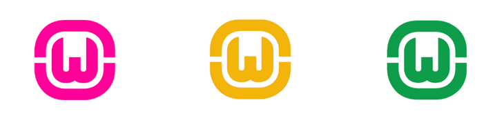
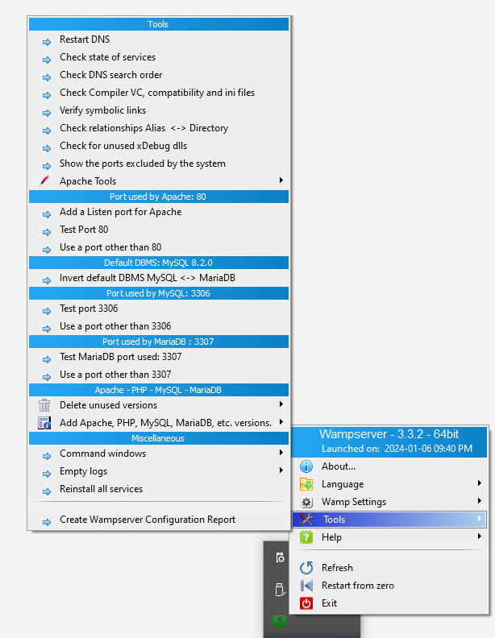

# WAMP

1. [Preuzimanje WAMP-a][wamp download]
2. Instalacija WAMP-a
   * Instalacija zavisnosti (Visual C++) ukoliko nisu instalirane. Mogu se naći na [WAMP-ovoj stranica za fajlove][deps - main] 
   ili [kao upakovana celnia koja sadrži sve neophodne zavisnosti na jednom mestu][deps - VisualCppRedist AIO]
3. Dodavanje sajta u `www` folder: `c:\wamp\www` (nije uvek ovde, zavisi od verzije i podešavanja)
4. Posećivanje phpMyAdmin-a na adresi: [http://localhost/phpmyadmin](http://localhost/phpmyadmin)
   * ako ne postoji, proveriti port
5. Prijava phpMyAdmin
   * username: `root`
   * password:  prazno polje (blank)
6. Import baze preko phpMyAdmin-a
7. Posećivanje stranice

---

Indikator WAMP-a ima više boja kojima se prikazuje status servisa:
* Crvena: ni jedan servis nije pokrenut
* Žuta: neki servisi su pokrenuti
* Zelena: svi servisi su pokrenuti

## Problemi

### Stranica ne postoji na datom linku

Nekada može postojati potreba za promenom podrazumevanih portova. Koristi sledeće portove:
* `80` za Apache
* `3306` za MariaDB
* `3308` za MySQL

Ukoliko je to slučaj, taj problem trebamo rešiti oslobađanjem potrebnog porta ili 
zamenom default-nih portova koje WAMP koristi.

### CORS - Error 403

Pri pokretanju projekta se nekada može javiti problem sa CORS-om.

Dolazi do sledeće greške: `java.io.IOException Invalid Status code 403`

To možemo rešiti [omogućavanjem zahteva sa drugih adresa, pomoću `--remote-allow-origins` opcije.][cors]

[#]: / (---------------------------------------------------------)

[wamp download]: https://sourceforge.net/projects/wampserver
[deps - main]: https://wampserver.aviatechno.net
[deps - VisualCppRedist AIO]: https://github.com/abbodi1406/vcredist/releases/latest

[cors]: https://www.youtube.com/watch?v=6jPWWirfg4w